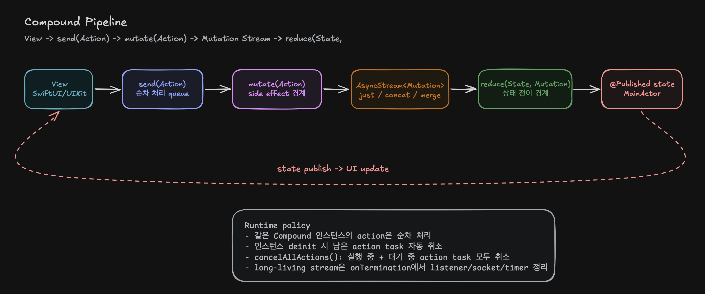
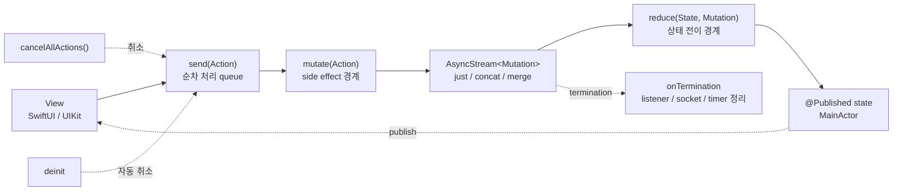

# Compound

Compound는 SwiftUI와 UIKit에서 사용할 수 있는 단방향 상태 관리 라이브러리입니다.

화면은 `Action`을 보내고, Compound는 `Action`을 `Mutation` stream으로 바꾼 뒤, 각 `Mutation`을 `State`에 순서대로 반영합니다.

## 목차

- [Compound가 하는 일](#compound가-하는-일)
- [설치](#설치)
- [기본 사용법](#기본-사용법)
- [SwiftUI에서 사용하기](#swiftui에서-사용하기)
- [UIKit에서 사용하기](#uikit에서-사용하기)
- [Mutation Stream 조합](#mutation-stream-조합)
- [취소 정책](#취소-정책)
- [동작 파이프라인](#동작-파이프라인)

## Compound가 하는 일

Compound는 화면 상태와 상태 변경 로직을 하나의 객체에 둡니다.

- `Action`: 화면에서 들어오는 사용자 의도입니다.
- `Mutation`: 상태를 어떻게 바꿀지 나타내는 값입니다.
- `State`: 화면이 관찰하는 현재 상태입니다.
- `mutate(action:)`: action을 하나 이상의 mutation으로 바꿉니다.
- `reduce(state:mutation:)`: mutation을 state에 적용해 다음 state를 만듭니다.

기본 흐름은 아래와 같습니다.

```text
View -> send(Action) -> mutate(Action) -> AsyncStream<Mutation> -> reduce(State, Mutation) -> State
```

## 설치

Swift Package Manager에서 이 저장소 URL을 추가해 사용합니다.

현재 로컬 개발 중이라면 Xcode의 `Package Dependencies`에서 이 패키지를 로컬 경로로 추가할 수 있습니다.

## 기본 사용법

```swift
import Combine
import Compound
import Foundation

final class CounterCompound: Compound {
    enum Action: Sendable {
        case increaseButtonTapped
        case decreaseButtonTapped
        case resetButtonTapped
    }

    enum Mutation: Sendable {
        case increaseCount
        case decreaseCount
        case setCount(Int)
    }

    struct State: Equatable {
        var count = 0
    }

    @Published var state = State()

    func mutate(action: Action) -> AsyncStream<Mutation> {
        switch action {
        case .increaseButtonTapped:
            return .just(.increaseCount)
        case .decreaseButtonTapped:
            return .just(.decreaseCount)
        case .resetButtonTapped:
            return .just(.setCount(0))
        }
    }

    func reduce(state: State, mutation: Mutation) -> State {
        var newState = state

        switch mutation {
        case .increaseCount:
            newState.count += 1
        case .decreaseCount:
            newState.count -= 1
        case .setCount(let count):
            newState.count = count
        }

        return newState
    }
}
```

동기적인 상태 변경은 `.just(...)`로 mutation 하나를 바로 방출하면 됩니다.
현재 state를 기준으로 한 계산은 가능하면 `reduce(state:mutation:)`에서 처리합니다.
`mutate(action:)`에서 현재 상태를 참고해야 하는 경우에는 `state`보다 `currentState`를 사용해 의도를 드러내는 편이 좋습니다.

## SwiftUI에서 사용하기

```swift
import Compound
import SwiftUI

struct CounterView: View {
    @StateObject private var compound = CounterCompound()

    var body: some View {
        VStack(spacing: 16) {
            Text("\(compound.state.count)")
                .font(.largeTitle.bold())

            Button("Increase") {
                compound.send(.increaseButtonTapped)
            }

            Button("Decrease") {
                compound.send(.decreaseButtonTapped)
            }

            Button("Reset") {
                compound.send(.resetButtonTapped)
            }
        }
    }
}
```

SwiftUI에서는 `@StateObject`나 `@ObservedObject`로 Compound를 소유하고, 화면 이벤트에서 `send(_:)`를 호출합니다.

## UIKit에서 사용하기

```swift
import Combine
import Compound
import UIKit

final class CounterViewController: UIViewController {
    private let compound = CounterCompound()
    private var cancellables = Set<AnyCancellable>()
    private let label = UILabel()

    override func viewDidLoad() {
        super.viewDidLoad()

        compound.$state
            .map(\.count)
            .removeDuplicates()
            .sink { [weak self] count in
                self?.label.text = "\(count)"
            }
            .store(in: &cancellables)
    }

    @objc private func increaseButtonTapped() {
        compound.send(.increaseButtonTapped)
    }
}
```

UIKit에서는 `@Published state`를 Combine으로 구독해 필요한 값만 UI에 반영합니다.

## Mutation Stream 조합

`mutate(action:)`은 `AsyncStream<Mutation>`을 반환합니다.
그래서 하나의 action에서 여러 mutation을 시간 순서대로 방출할 수 있습니다.

```swift
func mutate(action: Action) -> AsyncStream<Mutation> {
    switch action {
    case .refresh:
        return .concat(
            .just(.setLoading(true)),
            AsyncStream { continuation in
                Task {
                    do {
                        let items = try await service.fetchItems()
                        continuation.yield(.setItems(items))
                    } catch {
                        continuation.yield(.setErrorMessage(error.localizedDescription))
                    }

                    continuation.yield(.setLoading(false))
                    continuation.finish()
                }
            }
        )
    }
}
```

기본 조합 도구는 세 가지입니다.

- `.just(mutation)`: mutation 하나를 즉시 방출하고 종료합니다.
- `.concat(a, b, c)`: stream을 순서대로 이어 실행합니다.
- `.merge(a, b, c)`: stream을 동시에 실행하고 들어오는 순서대로 방출합니다.

상태 전이 순서가 중요하면 `concat`을 우선 사용하세요.
`merge`는 입력 순서가 아니라 완료/도착 순서대로 mutation이 반영됩니다.

## 취소 정책

같은 Compound 인스턴스에 들어온 action은 순차 처리됩니다.
앞 action의 mutation stream이 끝나야 다음 action이 이어집니다.

Firebase snapshot, socket, timer처럼 끝나지 않는 stream을 다룰 때는 action queue가 막힐 수 있습니다.
이럴 때 `cancelAllActions()`로 현재 실행 중이거나 대기 중인 action을 모두 취소할 수 있습니다.

```swift
compound.cancelAllActions()
```

`cancelAllActions()`는 state를 초기화하지 않습니다.
실행 흐름만 끊습니다.

long-living stream은 `onTermination`에서 외부 자원을 정리해야 합니다.

```swift
func mutate(action: Action) -> AsyncStream<Mutation> {
    switch action {
    case .observeMessages:
        return AsyncStream { continuation in
            let listener = firestore.addSnapshotListener { snapshot, error in
                continuation.yield(.setMessages(snapshot.messages))
            }

            continuation.onTermination = { _ in
                listener.remove()
            }
        }
    }
}
```

Compound 인스턴스가 해제되면 남아 있는 action task는 자동 취소됩니다.

## 동작 파이프라인



아래 Mermaid 다이어그램은 같은 흐름을 텍스트 기반으로 표현한 버전입니다.


