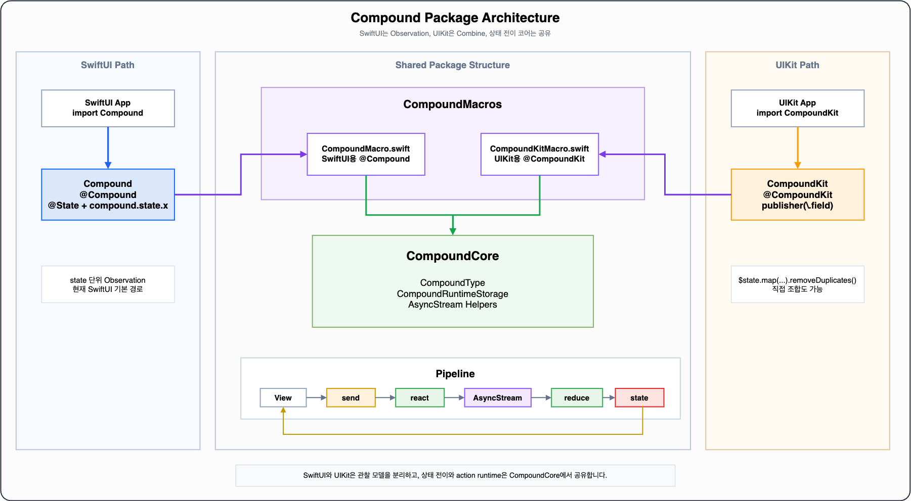
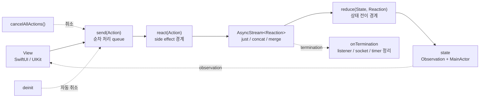

# Compound

Compound는 SwiftUI와 UIKit에서 사용할 수 있는 단방향 상태 관리 라이브러리입니다.

화면은 `Action`을 보내고, Compound는 `Action`을 `Reaction` stream으로 바꾼 뒤, 각 `Reaction`을 `State`에 순서대로 반영합니다.

## 목차

- [Compound가 하는 일](#compound가-하는-일)
- [설치](#설치)
- [기본 사용법](#기본-사용법)
- [SwiftUI에서 사용하기](#swiftui에서-사용하기)
- [UIKit에서 사용하기](#uikit에서-사용하기)
- [Reaction Stream 조합](#reaction-stream-조합)
- [취소 정책](#취소-정책)
- [동작 파이프라인](#동작-파이프라인)

## Compound가 하는 일

Compound는 화면 상태와 상태 변경 로직을 하나의 객체에 둡니다.

- `Action`: 화면에서 들어오는 사용자 의도입니다.
- `Reaction`: 상태를 어떻게 바꿀지 나타내는 값입니다.
- `State`: 화면이 관찰하는 현재 상태입니다.
- `react(action:)`: action을 하나 이상의 reaction으로 바꿉니다.
- `reduce(state:reaction:)`: reaction을 state에 적용해 다음 state를 만듭니다.

기본 흐름은 아래와 같습니다.

```text
View -> send(Action) -> react(Action) -> AsyncStream<Reaction> -> reduce(State, Reaction) -> State
```

## 설치

Swift Package Manager에서 아래 URL을 추가합니다.

```text
https://github.com/indextrown/Compound.git
```

`Package.swift`를 직접 수정한다면 다음처럼 추가합니다.

```swift
dependencies: [
    .package(url: "https://github.com/indextrown/Compound.git", from: "1.0.0")
]
```

사용할 target에는 필요한 product를 연결합니다.

```swift
.target(
    name: "YourTarget",
    dependencies: [
        .product(name: "Compound", package: "Compound")
    ]
)
```

UIKit/Combine 경로를 사용할 target에는 `CompoundKit` product를 연결합니다.

```swift
.target(
    name: "YourUIKitTarget",
    dependencies: [
        .product(name: "CompoundKit", package: "Compound")
    ]
)
```

패키지는 내부적으로 다음 구조를 가집니다.

- `CompoundCore`: 상태 전이 코어와 런타임
- `Compound`: SwiftUI / Observation 경로
- `CompoundKit`: UIKit / Combine 경로

Xcode에서는 `File > Add Package Dependencies...`에서 위 URL을 입력하고 `Dependency Rule`을 `Up to Next Major Version` / `1.0.0`으로 설정하면 됩니다.

## 기본 사용법

```swift
import Compound
import Foundation

@Compound
final class CounterCompound {
    enum Action {
        case increaseButtonTapped
        case decreaseButtonTapped
        case resetButtonTapped
    }

    enum Reaction {
        case increaseCount
        case decreaseCount
        case setCount(Int)
    }

    struct State: Equatable {
        var count = 0
    }

    var state = State()

    func react(action: Action) -> AsyncStream<Reaction> {
        switch action {
        case .increaseButtonTapped:
            return .just(.increaseCount)
        case .decreaseButtonTapped:
            return .just(.decreaseCount)
        case .resetButtonTapped:
            return .just(.setCount(0))
        }
    }

    @MainActor
    func reduce(state: State, reaction: Reaction) -> State {
        var newState = state

        switch reaction {
        case .increaseCount:
            newState.count += 1
        case .decreaseCount:
            newState.count -= 1
        case .setCount(let count):
            newState.count = count
        }

        return newState
    }
}
```

동기적인 상태 변경은 `.just(...)`로 reaction 하나를 바로 방출하면 됩니다.
`@Compound` 매크로는 `_compoundRuntime` 저장소와 `CompoundType` 채택을 자동으로 붙여주고, SwiftUI에서 사용할 수 있도록 `state`를 Observation 경로에 연결합니다.
현재 state를 기준으로 한 계산은 가능하면 `reduce(state:reaction:)`에서 처리합니다.
`react(action:)`에서 현재 상태를 참고해야 하는 경우에는 명시적인 메인 액터 hop을 고려하는 편이 좋습니다.

## SwiftUI에서 사용하기

```swift
import Compound
import SwiftUI

struct CounterView: View {
    @State private var compound = CounterCompound()

    var body: some View {
        VStack(spacing: 16) {
            Text("\(compound.state.count)")
                .font(.largeTitle.bold())

            Button("Increase") {
                compound.send(.increaseButtonTapped)
            }

            Button("Decrease") {
                compound.send(.decreaseButtonTapped)
            }

            Button("Reset") {
                compound.send(.resetButtonTapped)
            }
        }
    }
}
```

SwiftUI에서는 `@State`로 Compound를 소유하고, 화면 이벤트에서 `send(_:)`를 호출합니다.
현재 `@Compound`의 목표는 state 단위 Observation을 제공하는 SwiftUI 전환용 매크로입니다.
즉 지금 단계의 기본 읽기 경로는 `compound.state.xxx`이며, `ObservableObject + @Published state` 의존성을 걷어내는 것이 우선 목표입니다.

## UIKit에서 사용하기

UIKit은 `CompoundKit` product를 통해 분리된 경로를 사용합니다.
기본 사용 방식은 `@Published state`와 Combine slice subscription입니다.

```swift
import CompoundKit
import UIKit

final class CounterViewController: UIViewController {
    private let compound = CounterCompound()
    private var cancellables: Set<AnyCancellable> = []

    override func viewDidLoad() {
        super.viewDidLoad()

        compound.publisher(\.count)
            .sink { [weak self] count in
                self?.countLabel.text = "\(count)"
            }
            .store(in: &cancellables)
    }
}
```

더 직접적인 Combine 조합이 필요하면 기존처럼 `$state.map(...).removeDuplicates()` 경로를 사용할 수 있습니다.

## Reaction Stream 조합

`react(action:)`은 `AsyncStream<Reaction>`을 반환합니다.
그래서 하나의 action에서 여러 reaction을 시간 순서대로 방출할 수 있습니다.

배열이 아니라 `AsyncStream`을 사용하는 이유는 중간 상태를 즉시 반영하기 위해서입니다.
`[Reaction]`을 반환하는 구조에서는 비동기 작업이 모두 끝난 뒤 배열이 만들어지고, 그 다음 reaction들이 한 번에 처리되기 쉽습니다.
반면 `AsyncStream`은 reaction이 준비되는 순간마다 하나씩 `yield`할 수 있습니다.

예를 들어 새로고침에서는 로딩 시작을 먼저 반영하고, 네트워크 응답이 도착한 뒤 결과와 로딩 종료를 이어서 반영할 수 있습니다.

```text
배열 방식:
버튼 탭 -> fetch 완료 대기 -> [setLoading(true), setItems, setLoading(false)] 처리

AsyncStream 방식:
버튼 탭 -> setLoading(true) 즉시 처리 -> fetch 완료 -> setItems -> setLoading(false)
```

```swift
func react(action: Action) -> AsyncStream<Reaction> {
    switch action {
    case .refresh:
        return .concat(
            .just(.setLoading(true)),
            .run { send in
                do {
                    let items = try await service.fetchItems()
                    await send(.setItems(items))
                } catch {
                    await send(.setErrorMessage(error.localizedDescription))
                }

                await send(.setLoading(false))
            }
        )
    }
}
```

기본 조합 도구는 세 가지입니다.

- `.just(reaction)`: reaction 하나를 즉시 방출하고 종료합니다.
- `.run { send in ... }`: 비동기 작업 안에서 여러 reaction을 원하는 타이밍에 방출합니다.
- `.delay(duration, then: reaction)`: 일정 시간 뒤 reaction 하나를 방출하고 종료합니다.
- `.concat(a, b, c)`: stream을 순서대로 이어 실행합니다.
- `.merge(a, b, c)`: stream을 동시에 실행하고 들어오는 순서대로 방출합니다.

상태 전이 순서가 중요하면 `concat`을 우선 사용하세요.
`merge`는 입력 순서가 아니라 완료/도착 순서대로 reaction이 반영됩니다.

## 취소 정책

같은 Compound 인스턴스에 들어온 action은 순차 처리됩니다.
앞 action의 reaction stream이 끝나야 다음 action이 이어집니다.

Firebase snapshot, socket, timer처럼 끝나지 않는 stream을 다룰 때는 action queue가 막힐 수 있습니다.
이럴 때 `cancelAllActions()`로 현재 실행 중이거나 대기 중인 action을 모두 취소할 수 있습니다.

```swift
compound.cancelAllActions()
```

`cancelAllActions()`는 state를 초기화하지 않습니다.
실행 흐름만 끊습니다.

long-living stream은 `onTermination`에서 외부 자원을 정리해야 합니다.

```swift
func react(action: Action) -> AsyncStream<Reaction> {
    switch action {
    case .observeMessages:
        return AsyncStream { continuation in
            let listener = firestore.addSnapshotListener { snapshot, error in
                continuation.yield(.setMessages(snapshot.messages))
            }

            continuation.onTermination = { _ in
                listener.remove()
            }
        }
    }
}
```

Compound 인스턴스가 해제되면 남아 있는 action task는 자동 취소됩니다.

## `@Compound`가 해주는 일

`@Compound`를 붙이면 사용자는 핵심 선언만 작성하고, 런타임 저장소 보일러플레이트는 매크로가 맡습니다.

```swift
@Compound
final class CounterCompound {
    enum Action { case increaseButtonTapped }
    enum Reaction { case increase }
    struct State: Equatable { var count = 0 }

    var state = State()

    func react(action: Action) -> AsyncStream<Reaction> {
        .just(.increase)
    }

    func reduce(state: State, reaction: Reaction) -> State {
        var newState = state
        newState.count += 1
        return newState
    }
}
```

개념적으로는 아래 코드가 생성됩니다.

```swift
extension CounterCompound {
    private let _$observationRegistrar = ObservationRegistrar()

    func access(...) { ... }
    func withMutation(...) { ... }

    @MainActor
    let _compoundRuntime = CompoundRuntimeStorage()
}

extension CounterCompound: CompoundType, Observation.Observable {}
```

즉 사용자는 `Action`, `Reaction`, `State`, `var state`, `react`, `reduce`만 선언하면 됩니다.
현재 `@Compound`는 `@Observable`을 타입 상단에 다시 붙이는 방식이 아니라, SwiftUI 전환에 필요한 Observation 코드를 직접 합성하는 방식으로 동작합니다.

## 동작 파이프라인



아래 Mermaid 다이어그램은 같은 흐름을 텍스트 기반으로 표현한 버전입니다.


```mermaid
flowchart LR
    View["View<br/>SwiftUI / UIKit"]
    Send["send(Action)<br/>순차 처리 queue"]
    React["react(Action)<br/>side effect 경계"]
    Stream["AsyncStream&lt;Reaction&gt;<br/>just / concat / merge"]
    Reduce["reduce(State, Reaction)<br/>상태 전이 경계"]
    State["state<br/>Observation + MainActor"]

    View --> Send
    Send --> React
    React --> Stream
    Stream --> Reduce
    Reduce --> State
    State -. observation .-> View

    Cancel["cancelAllActions()"]
    Lifetime["deinit"]
    Cleanup["onTermination<br/>listener / socket / timer 정리"]

    Cancel -. 취소 .-> Send
    Lifetime -. 자동 취소 .-> Send
    Stream -. termination .-> Cleanup
```
